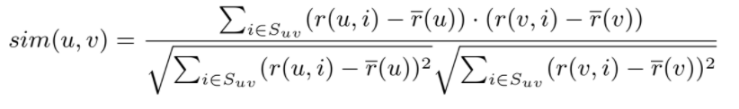
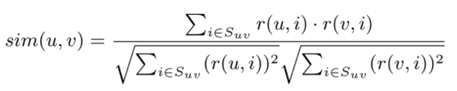
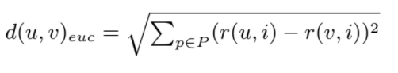

# Gestión del Conocimiento en las Organizaciones
## Práctica 4. Sistema de Recomendación
#

### Ejemplo de uso:

Descargar el proyecto y probar su ejecución desde el IDE Netbeans siguiendo las siguientes instrucciones:

Se requiere para el funcoinamiento del mismo 4 parámetros por línea de comandos:
* Fichero con la matriz original.
* Métrica elegida para las similitudes, a elegir entre Correlación de Pearson (1), Distancia Coseno (2), Distancia Euclídea (3).
* Número de vecinos a tener en cuenta. Se precisa un número mayor o igual a 3 para que los resultados sean significantes.
* Tipo de predicción, a elegir entre Predicción simple (1) y Diferencia con la media (2).

Dicho esto, y una vez descargado el proyecto, hay que seguir los siguientes pasos como se puede apreciar en la siguiente imagen:
 
 * **Run** --> **Set Project Configuration** --> **Customize** 

  
  
  
Tras esto, se abre una ventana emergente con una serie de opciones a la izquierda. Seleccione la opción **Run** y tendrá a la vista varias posibilidades. Lo primero es asegurar que la **Main Class** es correcta y acto seguido, introducir en el apartado **Arguments** los argumentos que se desee como se ve en la siguiente imagen:


Finalmente, solo restar presionar sobre la flecha verde (F6 dependiendo de la configuración del IDE) para compilar el proyecto:


#

### Ejemplo de ejecución:

* En línea de comandos:
```
test1.txt 1 2 2
```

En este caso, para emular el ejemplo de las diapositivas, se precisan solo 2 vecinos (parámetro 3).

Se obtiene la siguiente salida:

```txt
--------------------------------------------------
* Similaridad entre usuarios: 
 > Similitud del usuario 0 con el usuario 1: 0.8528028654224417
 > Similitud del usuario 0 con el usuario 2: 0.7071067811865475
 > Similitud del usuario 0 con el usuario 3: 0.0
 > Similitud del usuario 0 con el usuario 4: -0.7921180343813393
--------------------------------------------------
```

```txt
--------------------------------------------------
* Vecinos seleccionados:  1 2
--------------------------------------------------
```

```txt
--------------------------------------------------
* Usuario: 0 item: 4 --> valoración estimada: 4.871979899370592
--------------------------------------------------
```


```txt
* Matriz de utilidad: 

[5.0, 3.0, 4.0, 4.0, 4.871979899370592]
[3.0, 1.0, 2.0, 3.0, 3.0]
[4.0, 3.0, 4.0, 3.0, 5.0]
[3.0, 3.0, 1.0, 5.0, 4.0]
[1.0, 5.0, 5.0, 2.0, 1.0]
```

#

### Descripción del código

En este proyecto, se tienen una serie de ficheros, cada uno contiene clases y métodos necesarios para el correcto funcionamiento del mismo. El objetivo de este apartado es dar una breve explicación a cada uno de ellos:

* Código principal

En el fichero del programa principal, ``Recommendation.java`` hay dos clases, ``public class Recommendation`` y la ``class Pair``.

La primera contiene los siguientes métodos:

- ``public static List<int[]> readMatrix(String filename)``. Este método lee el fichero pasado como parámetro y lo convierte en una lista de enteros para su posterior manejo, además, sustituye los guiones ("-") de la matriz por un -1. También tiene un código try-catch para la gestión de errores.

- ``public static double predictRating(List<int[]> ratings, SimMeasure distance, int k, Prediction predType, int userindex, int itemindex)``.
Su objetivo es imprimir el resultado de la posible valoración que un usuario va a tener sobre un item concreto a través de las similitudes calculadas. Dependiendo de la métrica que se haya escogido se podrán obtener ditintos valores, así como a la hora del cálculo del tipo de predicción. 

- ``public static List<double[]> collaborativeFilter(List<int[]> ratings, SimMeasure distance, int k, Prediction predType)``.
Devuelve una lista de doubles con la matriz resultante con la predicción de los elementos faltantes en la matriz original.

- ``public static void main(String[] args)``. Es el main de la clase, recibe el vector de strings de los argumentos y tiene los recursos para analizar si estos son correctos o no, en tal caso enviará un mensaje de error. Además, tiene dos switch que hacen llamada a su correspondiente métrica y método de predicción.


Finalmente, la clase ``Pair``, permite almacenar el _valor_ y el _índice_. Imprescindible para poder seleccionar las similitudes más altas de los vecinos.
#

* SimMeasure.java

Este fichero contiene la clase abstracta ``public abstract class SimMeasure`` además de dos métodos:

- ``public abstract double measure(int[] u, int[] v)``. Método provisto de la clase padre para que más adelante, las subclases puedan realizar una implementación específica del mismo.
- ``public List<Integer> getSuv(int[] u, int[] v)``. Es una operación concurrente en las métricas de Pearson y la Distancia Coseno. Con este método se pretende obtener Suv, que es el conjunto de ítems calificados por u y v, siendo estos dos usuarios.

* Pearson.java

Este fichero contiene la ``public class Pearson extends SimMeasure``. Como indica la palabra reservada **extends**, es una clase hija de SimMeasure y hereda los métodos de la misma.

- ``public static double meanWithNan(int[] v, List<Integer> Suv)``. Realiza una media y lo devuelve como un double.
- ``public double measure(int[] u, int[] v)``. Realiza el cálculo de la similitud usando la fórmula de la Correlación de Pearson.



* CosineDistance.java

Este fichero contiene la ``public class CosineDistance extends SimMeasure``, otra de las clases hijas de SimMeasure y tiene un único método:
- ``public double measure(int[] u, int[] v)``. Este método realiza el cálculo de la similitud empleando la fórmula de la Distancia Coseno.



* EuclideanDistance.java

Este fichero contiene la ``public class EuclideanDistance extends SimMeasure``, también es una clase hija de SimMeasure y tiene un único método:
- ``public double measure(int[] u, int[] v)``. Este método realiza el cálculo de la similitud empleando la fórmula de la Distancia Euclídea.



#


