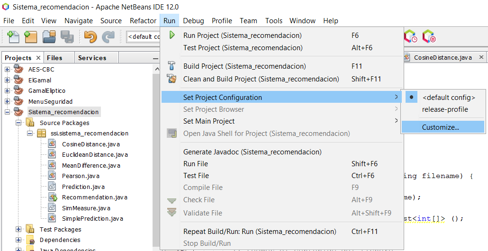
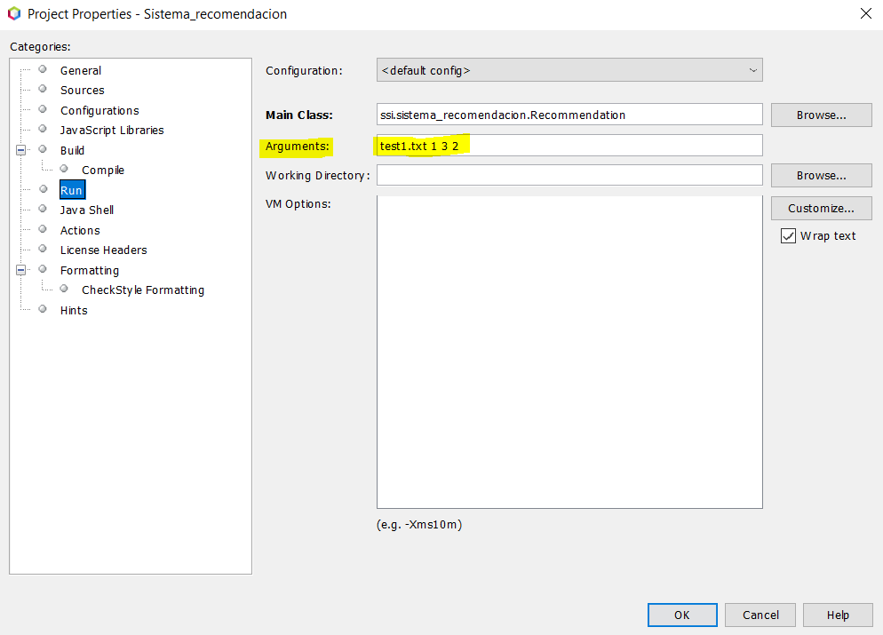
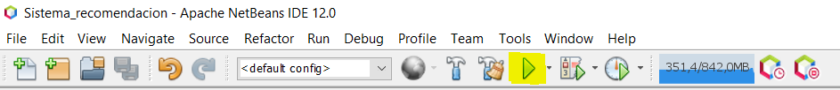

# Gestión del Conocimiento en las Organizaciones
## Práctica 4. Sistema de Recomendación
#

### Ejemplo de uso:

Descargar el proyecto y probar su ejecución desde el IDE Netbeans siguiendo las siguientes instrucciones:

Se requiere para el funcoinamiento del mismo 4 parámetros por línea de comandos:
* Fichero con la matriz original.
* Métrica elegida para las similitudes, a elegir entre Pearson (1), Distancia Coseno (2), Distancia Euclídea (3).
* Número de vecinos a tener en cuenta. Se precisa un número mayor o igual a 3 para que los resultados sean significantes.
* Tipo de predicción, a elegir entre Predicción simple (1) y Diferencia con la media (2).

Dicho esto, y una vez descargado el proyecto, hay que seguir los siguientes pasos como se puede apreciar en la siguiente imagen:
 
 * **Run** --> **Set Project Configuration** --> **Customize** 

  
  
  
Tras esto, se abre una ventana emergente con una serie de opciones a la izquierda. Seleccione la opción **Run** y tendrá a la vista varias posibilidades. Lo primero es asegurar que la **Main Class** es correcta y acto seguido, introducir en el apartado **Arguments** los argumentos que se desee como se ve en la siguiente imagen:



Finalmente, solo restar presionar sobre la flecha verde (F6 dependiendo de la configuración del IDE) para compilar el proyecto:



#

### Ejemplo de ejecución:

* En línea de comandos:
```
test1.txt 1 2 2
```

En este caso, para emular el ejemplo de las diapositivas, se precisan solo 2 vecinos (parámetro 3).

Se obtiene la siguiente salida:

```txt
--------------------------------------------------
* Similaridad entre usuarios: 
 > Similitud del usuario 0 con el usuario 1: 0.8528028654224417
 > Similitud del usuario 0 con el usuario 2: 0.7071067811865475
 > Similitud del usuario 0 con el usuario 3: 0.0
 > Similitud del usuario 0 con el usuario 4: -0.7921180343813393
--------------------------------------------------
```

```txt
--------------------------------------------------
* Vecinos seleccionados:  1 2 3
--------------------------------------------------
```

```txt
--------------------------------------------------
* Usuario: 0 item: 4 --> valoración estimada: 4.871979899370592
--------------------------------------------------
```


```txt
* Matriz de utilidad: 

[5.0, 3.0, 4.0, 4.0, 4.871979899370592]
[3.0, 1.0, 2.0, 3.0, 3.0]
[4.0, 3.0, 4.0, 3.0, 5.0]
[3.0, 3.0, 1.0, 5.0, 4.0]
[1.0, 5.0, 5.0, 2.0, 1.0]
```

#

